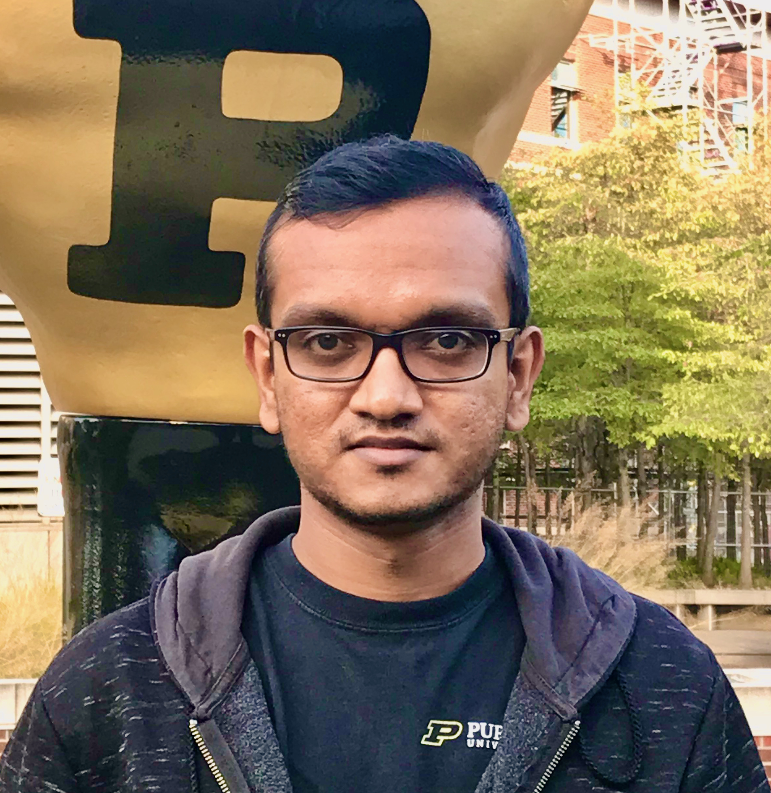

<!---->

   

 
I am actively looking for compiler R&D full-time roles starting summer 2023!

I am a PhD candidate in the Electrical and Computer Engineering Department of Purdue University and a member of Purdue Programming Languages Group ([PurPL](https://purduepl.github.io/)). My current research is focused on developing targeted compiler transformations to improve performance and reliability of programs with irregular control-flow. 
I also have experience in using program analysis techniques (e.g. Fuzzing, Symbolic Execution) to improve Performance Test Generation. 

I am fortunate to be advised by Prof. [Milind Kulkarni](https://engineering.purdue.edu/~milind/). 
<!-- 
 -->
 
<!--Have a look at my blog [here](blog).-->
## Publications

+ **HyBF: A Hybrid Branch Fusion Strategy for Code Size Reduction**  
  Rodrigo C. O. Rocha&nbsp;**\***, **Charitha Saumya**&nbsp;**\***, Kirshanthan Sundararajah, Pavlos Petoumenos, Milind Kulkarni, Michael O'Boyle (&nbsp;**\*** _equal contributions_ )   
  CC 2023 (Acceptance rate = 40%)
  <a href="" target="_blank"><i class="far fa-file-pdf fa-1x" style="color:black;"></i></a>
  <a href="https://github.com/charitha22/hybf-cc23-artifact" target="_blank"><i class="fa fa-github fa-1x" style="color:black;"></i></a>
  <!-- <a href="https://dl.acm.org/doi/10.1145/3563333" target="_blank"><i class="far fa-file-pdf fa-1x" style="color:black;"></i></a> -->
+ **UniRec: A Unimodular-like Framework for Nested Recursions and Loops**  
  Kirshanthan Sundararajah, **Charitha Saumya**, Milind Kulkarni   
  OOPSLA 2022 (Acceptance rate = 31%)
  <a href="https://dl.acm.org/doi/10.1145/3563333" target="_blank"><i class="far fa-file-pdf fa-1x" style="color:black;"></i></a>
+ **Cornucopia: A Framework for Feedback Guided Generation of Binaries**  
  Vidush Singhal, Akul Abhilash Pillai, **Charitha Saumya**, Milind Kulkarni, Aravind Machiry   
  ASE 2022 (Acceptance rate = 22%) 
  <a href="https://arxiv.org/pdf/2209.06694.pdf" target="_blank"><i class="far fa-file-pdf fa-1x" style="color:black;"></i></a>
+ **SparseLNR: Accelerating Sparse Tensor Computations Using Loop Nest Restructuring**  
    Adhitha Dias, Kirshanthan Sundararajah, **Charitha Saumya**, Milind Kulkarni   
  ICS 2022 (Acceptance rate = 24%) 
  <a href="https://dl.acm.org/doi/10.1145/3524059.3532386" target="_blank"><i class="far fa-file-pdf fa-1x" style="color:black;"></i></a>
  <a href="https://github.com/adhithadias/SparseLNR" target="_blank"><i class="fa fa-github fa-1x" style="color:black;"></i></a>
  <a href="https://www.youtube.com/watch?v=TGGrjp3c2-U&t=3s" target="_blank"><i class="fa fa-youtube fa-1x" style="color:black;"></i></a>
   
  <i class="fa fa-award fa-1x" style="color:#2a7ae2"></i>
  &nbsp;*Best Paper Award*
+ **DARM: Control-Flow Melding for SIMT Thread Divergence Reduction**  
    **Charitha Saumya**, Kirshanthan Sundararajah, Milind Kulkarni  
    CGO 2022 (Acceptance rate = 27%) 
    <a href="" target="_blank"><i class="far fa-file-pdf fa-1x" style="color:black;"></i></a>
    <a href="" target="_blank"><i class="far fa-file-powerpoint fa-1x" style="color:black;"></i></a>
    <a href="https://github.com/charitha22/cgo22ae-darm-benchmarks" target="_blank"><i class="fa fa-github fa-1x" style="color:black;"></i></a>
    <a href="https://www.youtube.com/watch?v=hBhjPZEgNmY" target="_blank"><i class="fa fa-youtube fa-1x" style="color:black;"></i></a>
    <!--\[[extended version](https://arxiv.org/abs/2107.05681)\]-->
+ **ADDS-EVS: An Agent-Based Deployment Decision-Support System for Electric Vehicle Services**  
    Zengxiang Lei, Jiawei Xue, Xiaowei Chen, **Charitha Saumya**, Xinwu Qian, Mingyi He, Stanislav Sobolevsky, Satish V Ukkusuri  
    ITSC 2021
    <a href="https://ieeexplore.ieee.org/abstract/document/9564435" target="_blank"><i class="far fa-file-pdf fa-1x" style="color:black;"></i></a>
+ **XSTRESSOR: Automatic Generation of Large-Scale Worst-Case Test Inputs by Inferring Path Conditions**  
   **Charitha Saumya**, Jinkyu Koo, Milind Kulkarni, Saurabh Bagchi  
   ICST 2019 (Acceptance rate = 28%)
    <a href="https://ieeexplore.ieee.org/document/8730162" target="_blank"><i class="far fa-file-pdf fa-1x" style="color:black;"></i></a> 
    <a href="" target="_blank"><i class="far fa-file-powerpoint fa-1x" style="color:black;"></i></a> 
    <a href="https://github.com/charitha22/XSTRESSOR" target="_blank"><i class="fa fa-github fa-1x" style="color:black;"></i></a>
     
    <i class="fa fa-award fa-1x" style="color:#2a7ae2"></i>
    &nbsp;*Distinguished Paper Award*
+ **PySE: Automatic Worst-Case Test Generation by Reinforcement Learning**  
   Jinkyu Koo, **Charitha Saumya**, Milind Kulkarni, Saurabh Bagchi  
   ICST 2019 (Acceptance rate = 28%) 
    <a href="https://ieeexplore.ieee.org/document/8730198" target="_blank"><i class="far fa-file-pdf fa-1x" style="color:black;"></i></a>
    <a href="" target="_blank"><i class="far fa-file-powerpoint fa-1.5x" style="color:black;"></i></a>
+ **Inertial Measurement Units based Wireless Sensor Network for Real Time Gait Analysis**  
   Imesh Lihinikaduarachchi, Sajith Rajapaksha, **Charitha Saumya**, Viraj Senevirathne,  Pujitha Silva  
   IEEE Region 10 Conference 2015
    <a href="https://ieeexplore.ieee.org/document/7372999" target="_blank"><i class="far fa-file-pdf fa-1x" style="color:black;"></i></a>

## Technical Talks 

+  <a href="https://www.youtube.com/watch?v=iGbdcItU0F8&list=PL_R5A0lGi1ACZDCQw533fo2dBljmOqIYx&index=20" target="_blank"> <b> Merging Similar Control-Flow Regions in LLVM for Performance and Code Size Benefits </b></a>
2022 LLVM Developers' Meeting, San Jose, CA   
   

## Education

<table class="tg">
<thead>
  <tr>
    <th class="tg-eo1f">PhD in Electrical and Computer Engineering</th>
    <th class="tg-gs09">Purdue University  (April 2023 Expected)</th>
  </tr>
</thead>
<tbody>
  <tr>
    <td class="tg-eo1f">MS in Electrical and Computer Engineering</td>
    <td class="tg-gs09">Purdue University  (December 2020)</td>
  </tr>
  <tr>
    <td class="tg-eo1f">BS in Electronic and Telecommunication Engineering</td>
    <td class="tg-gs09">University of Moratuwa, Sri Lanka  (May 2015)</td>
  </tr>
</tbody>
</table>

## Work Experience

<table class="tg">
<thead>
  <tr>
    <th class="tg-eo1f">Research Intern</th>
    <th class="tg-gs09">Adobe Research, San Jose, CA  (Summer 2020)</th>
  </tr>
</thead>
<tbody>
  <tr>
    <td class="tg-eo1f">Software Engineering Intern</td>
    <td class="tg-gs09">Bigstream, Mountian View, CA  (Summer 2019)</td>
  </tr>
  <tr>
    <td class="tg-eo1f">Associate Software Engineer</td>
    <td class="tg-gs09">Paraqum Technologies, Colombo, Sri Lanka  (2015 - 2016)</td>
  </tr>
  <tr>
    <td class="tg-eo1f">Software Engineering Intern</td>
    <td class="tg-gs09">MillenniumIT Software, Colombo, Sri Lanka  (2013 - 2014)</td>
  </tr>
</tbody>
</table>

## Professional Service

* Artifact Evaluation Committee: CGO 2023
* Student Volunteer: SPLASH 2021
* External Reviewer: ISSRE 2017, 2018, DSN 2021
* Undergraduates Advised: Pranavi Bajjuri, Ganesh Varnekar, Vidush Singhal

