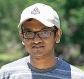

<!---->
 

Hi! I am a PhD student in Electrical and Computer Engineering department of Purdue university. I am interested in software testing and optimizing compilers for heterogeneous architectures. I am advised by prof. Milind Kulkarni. Before Purdue, I attended University of Moratuwa in Sri Lanka where I obtained a BS in Electronics and Telecommunications.
## Publications

1. **XSTRESSOR: Automatic Generation of Large-Scale Worst-Case Test Inputs by Inferring Path Conditions**  
   Charitha Saumya, Jinkyu Koo, Milind Kulkarni, Saurabh Bagchi  
   ICST 2019 (Acceptance rate = 28.1%) <a href="PID5758301.pdf" target="_blank"><i class="fas fa-file-pdf fa-1x" style="color:red;"></i></a>
   <a href="https://github.com/charitha22/XSTRESSOR" target="_blank"><i class="fab fa-github fa-1x" style="color:black;"></i></a>
2. **PySE: Automatic Worst-Case Test Generation by Reinforcement Learning**  
   Jinkyu Koo, Charitha Saumya, Milind Kulkarni, Saurabh Bagchi  
   ICST 2019 (Acceptance rate = 28.1%)
3. **Orion+: Automated Problem Diagnosis in Computing Systems by Mining Metric Data**  
   Charitha Saumya, Nomchin Banga, Shreya Inamdar  
   Purdue e-Pubs 2018
4. **Inertial Measurement units based wireless sensor network for real time gait analysis**  
   Imesh Lihinikaduarachchi, Sajith Rajapaksha, Charitha Saumya, Viraj Senevirathne and Pujitha Silva  
   IEEE Region 10 Conference 2015

## Work Experience

* Summer 2019  
    Software Engineering Intern, Bigstream, Mountian View, CA
* 2015 - 2016  
    Associate Software Engineer, Paraqum Technologies, Colombo, Sri Lanka
* 2013 - 2014  
    Trainee Software Engineer, MillenniumIT Software, Colombo, Sri Lanka

## Professional Service
* External reviewer for ISSRE 2017, 2018
* Summer Interns advised : Pranavi Bajjuri, Ganesh Varnekar

*Last Updated : 7th September 2019*
<!--## Typography-->

<!--This is a [link](http://google.com). Something *italics* and something **bold**.-->

<!--Here is a table-->

<!--Year | Award | Category-->
<!-------|-------|---------->
<!--2014 | Emmy  | Won Outstanding Lead Actor in a miniseries or a movie-->
<!--2015 | BAFTA | Nominated for Best Leading Actor for Sherlock-->
<!--2014 | Satellite | Won Best Actor miniseries or television film-->

<!--Here is a horizontal rule-->

<!------->

<!--Here is a blockquote-->

<!-- To a great mind, nothing is little-->

<!--## References-->

<!--* Foo Bar: Head of Department, Placeholder Names, Lorem-->
<!--* John Doe: Associate Professor, Department of Computer Science, Ipsum-->
